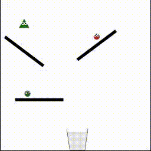

# CRAFT

This repository contains the codes used to generate the CRAFT dataset as described in the paper:

**CRAFT: A Benchmark for Causal Reasoning About Forces and inTeractions**
 Tayfun Ates*, M. Samil Atesoglu*, Cagatay Yigit*, Ilker Kesen, Mert Kobas, Erkut Erdem, Aykut Erdem, Tilbe Goksun, Deniz Yuret
 *NeurIPS 2021 Submission, Datasets and Benchmarks Track*

[OpenReview Preprint](https://openreview.net/pdf?id=GVe2IvtZtVY), [Project Website](https://sites.google.com/view/craft-benchmark) 

The dataset is available on [Zenodo](https://zenodo.org/record/4904783).
___

Below is a sample from the dataset, a video of the simulation and some of the questions asked: 

**Descriptive**
 
**Q:** "What is the shape of the first object that collided with the tiny green circle?  **A:** "Triangle"
 
**Q:** "After hitting the floor, does the small green triangle collide with other objects?"  **A:** "False"
 
**Counterfactual**
 
**Q:** "If the tiny green circle is removed, will the small green triangle fall to the ground?"  **A:** "False"
 
**Q:** "If any of the other objects are removed, will the tiny green circle end up in the basket?" **A:** "True"
 
**Cause**
 
**Q:** "There is a tiny green circle, does it stimulate the tiny green triangle to fall to the floor?" **A:** "True"
 
**Q:** "Does the tiny green triangle lead to the small red circle ending up in the bucket?"  **A:** "True"
 
**Enable**
 
**Q:** "There is a small red circle, does it enable the tiny green circle to hit the ground?" **A:** "True"
 
**Q:** "What is the number of objects that the small red circle allows to hit the floor?" **A:** "1"
 
**Prevent**
 
**Q:** "There is a tiny green triangle, does it hinder the tiny green circle from going into the container?" **A:** "True"
 
**Q:** "How many objects are prevented by the tiny green triangle from falling into the basket?" **A:** "1"

## About the Codebase

### Simulator 

`data_generation` folder contains the simulator that we used to render 2D physics simulations which output simulation data used to generate questions. You can go to [here](./data_generation/2d/CRAFT-Box2D) for detailed explanations.

### Question Generation

`question_generation` folder contains the scripts used to generate the dataset by running simulations and generating questions. You can go to [here](./question_generation) for detailed explanations.

### Models
`
models` folder contains the training and testing scripts used to train the methods evaluated in our paper. You can go to [here](./models) for detailed explanation.

